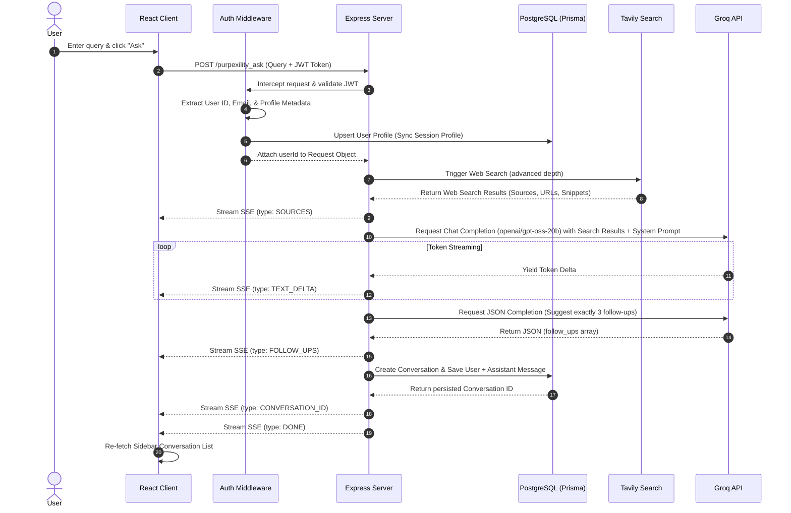

# DeepFind — Search Synthesis Engine

DeepFind is a production-ready, AI-powered Search Synthesis Engine inspired by Perplexity. The application leverages real-time web crawling, Large Language Models (LLMs), and server-sent event (SSE) streaming to deliver synthesized, cited answers to user queries.

Built with a modern web architecture, DeepFind implements secure social OAuth login, custom database state synchronization, and multi-turn conversational capabilities that maintain chat context across follow-up searches.

---

## Technical Architecture Overview

DeepFind follows a decoupled client-server architecture built on top of the ultra-fast **Bun** runtime. 

### Core Architecture Diagram
```mermaid
graph TD
    subgraph Client [React Frontend (Bun)]
        UI[Glassmorphic Dashboard UI]
        SSE[SSE Stream Reader]
        SupaClient[Supabase Client Auth]
    end

    subgraph ServiceLayer [Express Backend (Bun)]
        API[Express Router]
        AuthMW[Authentication Middleware]
        TavClient[Tavily Search SDK]
        GroqClient[Groq LLM SDK]
        Prisma[Prisma ORM]
    end

    subgraph Database [Storage & External APIs]
        PG[(Supabase PostgreSQL)]
        SupaAuth[Supabase Auth Service]
        TavilyAPI[Tavily Search API]
        GroqAPI[Groq Inference Engine]
    end

    %% Client Interactions
    UI -->|JWT Auth Session| SupaClient
    SupaClient <-->|OAuth Flow| SupaAuth
    UI -->|GET/POST Requests + Auth Header| API
    SSE <-->|Server-Sent Events Stream| API

    %% Backend Integrations
    API -->|Authenticate JWT Token| AuthMW
    AuthMW <-->|Verify Token| SupaAuth
    AuthMW -->|Upsert User & Sync State| Prisma
    API -->|Fetch Live Search Index| TavClient
    TavClient <-->|Query Web Data| TavilyAPI
    API -->|Stream Inference Completion| GroqClient
    GroqClient <-->|inference Model: openai/gpt-oss-20b| GroqAPI
    API -->|Persist Conversations & Messages| Prisma
    Prisma <-->|Query & Mutations| PG
```

### Request-Response Cycle for AI Search


---

## Key Features

- **Real-Time Web Search Integration**: Queries the web dynamically using the Tavily Search API with `advanced` search depth.
- **Server-Sent Events (SSE) Streaming**: Delivers sub-second initial responses by streaming token completions from Groq directly to the React interface.
- **Multi-Turn Conversational Context**: Tracks previous prompts and assistant responses, compounding queries to allow natural follow-up questions that remain contextually aware.
- **Automated Suggestion Engine**: Utilizes LLMs to generate exactly three contextually relevant follow-up prompts formatted as interactive UI actions.
- **OAuth Authentication Lifecycle**: Implements Google and GitHub authentication, mapping secure Supabase credentials to internal relational tables.
- **Recent Chat Sidebar**: Persists and displays historical threads allowing users to swap seamlessly between active and past conversations.
- **Modern Responsive Design**: Featuring high-end Glassmorphism, ambient blurred gradients, micro-animations, and full dark-theme visual comfort built using Tailwind CSS v4.

---

## Tech Stack

### Frontend
- **Framework**: React 19
- **Routing**: React Router v7
- **Styling**: Tailwind CSS v4, Lucide React (Icons), Radix UI (Select, Slots, Labels)
- **Networking**: Axios, Fetch API (Stream Reader)
- **Runtime & Bundler**: Bun (`Bun.build` with custom dev pipeline)

### Backend
- **Framework**: Express (Node/Bun environment)
- **Inference Pipeline**: Groq SDK (`openai/gpt-oss-20b` model)
- **Web Crawling**: Tavily Core SDK
- **Database Access**: Prisma ORM (with PostgreSQL native pg-adapter)
- **Auth Sync**: Supabase JS SDK

### Database & Hosting Providers
- **Database**: PostgreSQL (hosted on Supabase)
- **Authentication**: Supabase Auth (configured for OAuth)

---

## Project Structure

```
Purplexity/
├── backend/
│   ├── prisma/
│   │   ├── migrations/         # Database migration logs
│   │   └── schema.prisma      # Prisma schema (Models: User, Conversation, Message)
│   ├── db.ts                  # Instantiates PrismaClient with node-pg adapter
│   ├── index.ts               # Express application server and LLM route configurations
│   ├── middleware.ts          # Supabase Token Verifier & User Synchronization Hook
│   ├── package.json           # Bun runtime dependencies for backend
│   ├── prompt.ts              # System instructions and dynamic prompts
│   ├── supabase.ts            # Initializes Supabase Admin-level credentials
│   └── tsconfig.json          # TypeScript server configuration
├── frontend/
│   ├── src/
│   │   ├── components/
│   │   │   └── ui/            # Reusable UI primitives (Buttons, Cards, Inputs, Selects)
│   │   ├── lib/
│   │   │   ├── supabase.ts    # Configures client-side Supabase SDK
│   │   │   └── utils.ts       # Tailwind class merger utility
│   │   ├── pages/
│   │   │   ├── Auth.tsx       # OAuth Login UI screen
│   │   │   └── Dashboard.tsx  # Central chat canvas, sidebar, & stream handler
│   │   ├── App.tsx            # Main router
│   │   ├── APITester.tsx      # Diagnostic utility for API validation
│   │   ├── frontend.tsx       # React DOM entry point
│   │   ├── index.css          # Tailwind CSS layer definitions
│   │   └── index.html         # HTML Document template
│   ├── styles/
│   │   └── globals.css        # Custom dark mode styles and scrollbars
│   ├── build.ts               # Production asset builder using Bun compiler
│   └── package.json           # Frontend dependencies and scripts
└── README.md                  # This file
```

---

## Database Design

The relational database is orchestrated using Prisma. It consists of three primary tables: `User`, `Conversation`, and `Message`.

```prisma
model User {
  id            String         @id @default(cuid())
  email         String         @unique
  name          String
  provider      AuthProvider
  conversations Conversation[]
}

model Conversation {
  id        String    @id @default(cuid())
  title     String?
  messages  Message[]
  userId    String
  user      User      @relation(fields: [userId], references: [id])
  followUps String[]  @default([])
}

model Message {
  id             Int          @id @default(autoincrement())
  content        String
  role           MessageRole
  conversationId String
  conversation   Conversation @relation(fields: [conversationId], references: [id])
  createdAt      DateTime     @default(now())
}
```

- **User** tracks the authenticated provider session.
- **Conversation** acts as the parent thread holding the title and cached suggestions array.
- **Message** keeps sequential records of prompts and responses with timestamps.

---

## Installation & Configuration

### Prerequisites
- [Bun](https://bun.sh) runtime installed (`v1.0.0` or higher).
- A [Supabase](https://supabase.com) account & PostgreSQL instance.
- A [Groq Console](https://console.groq.com) account (for API Key).
- A [Tavily AI](https://tavily.com) account (for search API access).

### 1. Clone & Set Up Environments

Create configuration files in both `backend` and `frontend`.

#### Backend Environment Settings (`backend/.env`)
```ini
TAVILY_API_KEY=your_tavily_api_key
GROQ_API_KEY=your_groq_api_key

# Transaction mode pooler connection string (Port 6543 for PgBouncer)
DATABASE_URL="postgresql://postgres.[username]:[password]@[host]:6543/postgres?pgbouncer=true"

# Direct connection string for schema migrations (Port 5432)
DIRECT_URL="postgresql://postgres.[username]:[password]@[host]:5432/postgres"
```

#### Frontend Environment Settings (`frontend/.env`)
```ini
VITE_SUPABASE_URL=https://your_project_ref.supabase.co
VITE_SUPABASE_PUBLISHABLE_KEY=your_supabase_anon_key
```

---

## Database Initialization

Prisma client generates its schema inside a custom output path (`prisma/generated`). To compile client libraries and synchronize tables:

```bash
cd backend
# Install dependencies
bun install

# Run database synchronization / apply schema modifications
bun --bun prisma db push

# Generate Prisma Client classes
bun --bun prisma generate
```

---

## Running Locally

To start the application, run both the backend Express server and the frontend React hot reload server.

### Start Backend Server
```bash
cd backend
bun run index.ts
```
The server will boot and listen on `http://localhost:3000`.

### Start Frontend Dev Server
```bash
cd frontend
bun install
bun run dev
```
The client application will spin up at `http://localhost:5173`.

---

## API Documentation

All stateful endpoints require a valid JWT token sent within the `Authorization` header.

### 1. Fetch Conversations
- **Endpoint**: `GET /conversations`
- **Headers**: `Authorization: <SUPABASE_JWT_TOKEN>`
- **Response**: List of all conversations belonging to the authenticated user.

### 2. Fetch Conversation Details
- **Endpoint**: `GET /conversation/:id`
- **Headers**: `Authorization: <SUPABASE_JWT_TOKEN>`
- **Response**: Details of a conversation, including all its messages.

### 3. Synthesize New Query (SSE)
- **Endpoint**: `POST /purpexility_ask`
- **Headers**: `Authorization: <SUPABASE_JWT_TOKEN>`
- **Body**: `{ "query": "Your search query string" }`
- **Output (Stream)**: Streams Server-Sent Events with the following message blocks:
  - `type: SOURCES`: Contains array of `{ title, url }` search results.
  - `type: TEXT_DELTA`: Yields sequential markdown stream content.
  - `type: FOLLOW_UPS`: Yields a JSON list of suggested next questions.
  - `type: CONVERSATION_ID`: Returns the ID of the newly generated database conversation thread.
  - `type: DONE`: Signals stream closing.

### 4. Synthesize Follow-Up Query (SSE)
- **Endpoint**: `POST /purpexility_ask/follow_ups`
- **Headers**: `Authorization: <SUPABASE_JWT_TOKEN>`
- **Body**: `{ "conversationId": "cuid", "query": "The follow up prompt" }`
- **Output (Stream)**: Streams Server-Sent Events incorporating prior conversation history as context.

---

## Application Workflows & Technical Tradeoffs

### 1. User Session & State Sync Pipeline
```
Supabase OAuth Login (Client) ──> Client retrieves JWT Token 
   ──> Client attaches JWT to Request Headers
   ──> Backend middleware intercepts request 
   ──> backend validates token with Supabase Auth
   ──> If valid, backend upserts User row in private PostgreSQL instance
```
* **Technical Tradeoff**: Standard auth architectures query the database directly. By verifying the JWT first and upserting the user record lazily, we ensure that new users signing up via external social providers require zero manual registration endpoints.

### 2. Live Web Search & Stream Integration
* **Search Choice**: The backend uses Tavily Search API with `advanced` search depth. This returns clean page content instead of messy raw HTML, reducing prompt token count and avoiding web scraper blocking issues.
* **Double LLM Pass Design**: 
  - *First Pass (Streaming)*: Combines the raw search results JSON with the user's prompt to generate a detailed, structured response immediately.
  - *Second Pass (Non-Streaming)*: Executes asynchronously to generate exactly 3 contextual follow-up questions formatted as an array.
* **Saving States**: Saving to the database happens inside a transaction AFTER the streaming completes. This prevents saving database records for failed requests or aborted client streams.

---

## Future Roadmap

1. **Markdown and Citations Rendering**: Add `react-markdown` to parse formatted mathematical expressions, tables, and lists in generated output, and create hoverable annotations linking directly to the list of source references.
2. **Persistent Web Sources**: Add a relation schema in PostgreSQL to store the scraped web search results, so past conversations load their references immediately.
3. **Conversations Management**: Add endpoints to delete chat threads and rename session titles.
4. **Offline Mode / Multi-Model Support**: Add options in the frontend UI to select different Groq inference engines (e.g. LLaMA, Mixtral) dynamically.

---

## Contributing

1. Fork the Repository.
2. Create your Feature Branch (`git checkout -b feature/NewFeature`).
3. Commit your changes (`git commit -m 'Add NewFeature'`).
4. Push to the Branch (`git push origin feature/NewFeature`).
5. Open a Pull Request.

---

## License

This project is licensed under the MIT License - see the LICENSE file for details.
